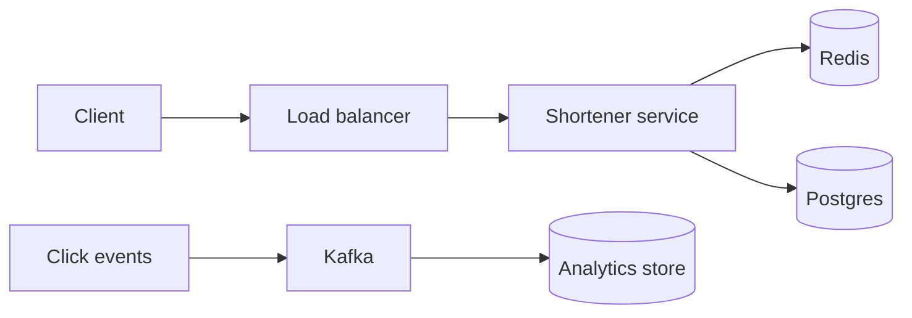

# URL shortener — design doc

> Practice 01 · After Phases 1–2

## 1. Requirements

**Functional**
- `POST /shorten {url}` → `{shortUrl}`.
- `GET /{code}` → 301/302 redirect to original URL.
- Custom aliases (optional).
- Click analytics (optional).

**Non-functional**
- Read:write ≈ 100:1.
- p99 redirect latency < 50ms.
- 99.9% availability.
- Codes never reused (even after deletion).

**Out of scope**: user accounts, payments, ad injection.

## 2. Capacity estimate
Fill these in for your target scale:
- New shortens per day: ______
- Redirects per second (peak): ______
- Storage per record: ~500 bytes → total/year: ______
- Cache size for 90% hit rate: ______

## 3. API
| Method | Path | Body | Response |
|---|---|---|---|
| POST | `/api/v1/shorten` | `{url, customAlias?}` | `{shortUrl, code, expiresAt}` |
| GET | `/{code}` | — | 301 to long URL |
| GET | `/api/v1/links/{code}/stats` | — | `{clicks, lastClickAt}` |

## 4. Data model
```
links (
  code         VARCHAR(10) PRIMARY KEY,
  long_url     TEXT NOT NULL,
  created_at   TIMESTAMPTZ DEFAULT now(),
  expires_at   TIMESTAMPTZ,
  owner_id     UUID NULL
)
```
Index on `expires_at` for cleanup.

## 5. High-level architecture


## 6. Deep dives

### 6.1 Code generation
Choose:
- **Base62 of an auto-increment counter** — simple, predictable, but enumerable.
- **Random 7-char base62** — needs collision check; collision rare with 62^7 ≈ 3.5T codes.
- **Hash of (url + salt) prefix** — deterministic; same URL → same code (a feature or bug?).

### 6.2 Caching
- Cache `code → long_url` in Redis with TTL.
- On miss: DB read, populate cache.
- Invalidate on update/delete.

### 6.3 Click tracking
- Don't write to DB on every redirect → async via Kafka or fire-and-forget counter increment in Redis, periodic flush.

## 7. Failure modes
- DB down: serve from cache; new shortens fail fast with 503.
- Cache down: degrade to DB-only, raise alert; expect latency spike.
- Kafka down: drop analytics events (or buffer to disk); user-facing not affected.

## 8. Trade-offs
- Random vs counter codes: ______
- Cache TTL: ______
- 301 (cached by browsers) vs 302 (always hits server, more accurate analytics): ______
