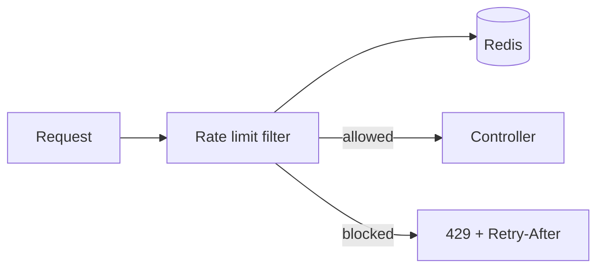

# Distributed rate limiter — design doc

> Practice 02 · After Phases 1–2

## 1. Requirements

**Functional**
- Limit requests per `(key, route)` tuple.
- Return 429 + `Retry-After` when exceeded.
- Support multiple policies: per-IP, per-API-key, per-user.

**Non-functional**
- Decision latency < 5ms p99 (added to every request).
- Accurate across N service instances.
- Fail open vs fail closed — design choice.

## 2. Capacity estimate
- RPS to be rate-limited: ______
- Number of distinct keys: ______
- Memory in Redis: ~50 bytes per key × keys = ______

## 3. API
This is library/middleware, not a public API. Typical usage:
```java
@RateLimit(key="#userId", limit=100, perMinute=1)
public Order place(@Valid OrderRequest r, @AuthenticationPrincipal User u) {...}
```

## 4. Data model (Redis)
Token bucket: `bucket:{key}` → hash `{tokens, lastRefillMs}` with TTL.

Or sliding window counter: `swcounter:{key}:{minute}` → INT.

## 5. High-level architecture


## 6. Deep dives

### 6.1 Algorithm choice
- Compare fixed window, sliding window log, sliding window counter, token bucket. Pick one + justify.

### 6.2 Atomicity
- Use a Lua script in Redis to read + decide + update in one round trip. Without it, race conditions overcount/undercount.

### 6.3 Distribution model
- **Centralized Redis**: simple, correct, adds 1ms latency.
- **Local + sync**: each instance enforces local limit (`global/N`), reconciles periodically. Faster, less accurate.

### 6.4 Fail mode
- Redis down → fail **open** (let traffic through, alert) or fail **closed** (reject)? Default: fail open for user-facing, fail closed for security-sensitive routes (login).

## 7. Failure modes
- Redis latency spike → request latency spike. Set a tight Redis timeout; on timeout, fail open with logging.
- Hot key → single Redis shard saturated. Solution: shard the key (`{key}:{hash%4}`) and aggregate.

## 8. Trade-offs
- Accuracy vs latency: ______
- Fail open vs fail closed: ______
- Centralized vs distributed counters: ______
