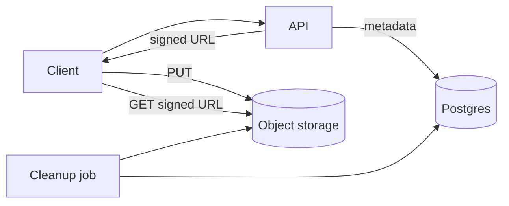

# Pastebin / file share — design doc

> Practice 03 · After Phases 1–2

## 1. Requirements

**Functional**
- Upload text/file → get a shareable URL.
- Expiry (1 day, 1 week, never).
- Optional password protection.
- Optional one-time view.

**Non-functional**
- Files up to 100 MB.
- Read:write 100:1.
- Cheap storage tiering for cold pastes.

## 2. Capacity estimate
- Uploads/day: ______
- Avg paste size: ______ → storage/year: ______
- Reads/sec peak: ______

## 3. API
| Method | Path | Body | Response |
|---|---|---|---|
| POST | `/api/v1/pastes` | text or multipart file | `{id, url, expiresAt}` |
| GET | `/p/{id}` | — | raw paste or HTML viewer |
| DELETE | `/api/v1/pastes/{id}` | — | 204 |

## 4. Data model
```
pastes (
  id          VARCHAR(12) PRIMARY KEY,
  storage_key TEXT NOT NULL,    -- S3 object key
  size_bytes  BIGINT,
  mime_type   TEXT,
  password_hash TEXT NULL,
  one_time    BOOLEAN DEFAULT false,
  expires_at  TIMESTAMPTZ,
  created_at  TIMESTAMPTZ DEFAULT now()
)
```

## 5. High-level architecture


## 6. Deep dives

### 6.1 Direct upload to S3
Don't proxy bytes through your app — issue a pre-signed PUT URL. App handles metadata only.

### 6.2 Direct download
Issue pre-signed GET URLs. App enforces auth/password, then redirects to the signed URL.

### 6.3 Expiry / cleanup
- S3 lifecycle rule for object expiry (cheap).
- Cron job to delete expired DB rows.

### 6.4 One-time view
- DB column `consumed_at`. On GET, atomic update; if first writer, serve; else 410.

## 7. Failure modes
- S3 down → uploads/downloads fail; user sees retryable error.
- Orphaned objects (DB row deleted, S3 object remains): periodic reconciliation job.
- Orphaned DB rows (S3 upload failed mid-flight): TTL on "pending" rows.

## 8. Trade-offs
- Public bucket + obscure key vs signed URLs: ______
- Inline text in DB vs always S3: ______
- Password hashing cost vs UX: ______
