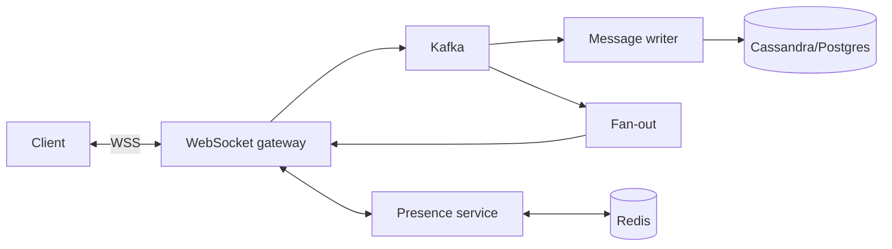

# Chat service — design doc

> Practice 04 · After Phase 3

## 1. Requirements

**Functional**
- 1:1 and group chats.
- Send/receive messages in real time.
- Message history.
- Presence (online/offline/typing).
- Multi-device sync.

**Non-functional**
- p99 message delivery < 200ms within region.
- At-least-once delivery; in-order per conversation; idempotent on resend.
- Concurrent connections: ______ per server.

## 2. Capacity estimate
- DAU: ______
- Avg messages per user per day: ______ → msgs/sec: ______
- Avg message size: ~500 B → bandwidth: ______
- Online users at peak (= WebSocket conns): ______

## 3. API
- WebSocket: `wss://chat.example.com/ws?token=...`
- Inbound msg: `{type:"send", convId, clientMsgId, text}`
- Outbound msg: `{type:"msg", convId, msgId, senderId, text, ts}`
- REST for history: `GET /api/v1/convos/{id}/messages?before=...`

## 4. Data model
```
conversations(id, type, created_at)
participants(conv_id, user_id, joined_at)
messages(conv_id, msg_id ULID, sender_id, text, ts)  -- partition by conv_id
delivery(user_id, conv_id, last_read_msg_id)
```
ULID = sortable, time-ordered → range queries are efficient.

## 5. High-level architecture


## 6. Deep dives

### 6.1 WebSocket gateway
- Stateless except for the active socket. Map `userId → (gatewayInstance, connectionId)` in Redis so a fan-out service knows where to deliver.
- Use Netty / virtual threads to handle 100k+ connections per instance.

### 6.2 Fan-out
- For 1:1 / small groups: push directly to each recipient's gateway.
- For huge groups (10k+ members): publish to a topic; recipient gateways subscribe.

### 6.3 Idempotency & ordering
- Client sends `clientMsgId`. Server dedupes. Server-assigned `msgId` is ULID-ordered per conversation.

### 6.4 Multi-device
- Per-device "cursor" in `delivery`. Messages stored once, each device tracks its own read position.

### 6.5 Presence
- `SETEX presence:{userId} 30 "online"` on heartbeat. Subscribers via Redis pub/sub.

## 7. Failure modes
- Gateway crashes → clients reconnect, resume from last `msgId`.
- Kafka down → can't accept new messages; clients see "sending..." indefinitely until retry succeeds.
- DB write lag → messages delivered but disappear from history briefly (acceptable?).

## 8. Trade-offs
- Push to gateway vs pull from gateway: ______
- Cassandra (write-optimized, partition by conv) vs Postgres (simpler): ______
- Strict order vs availability during partition: ______
