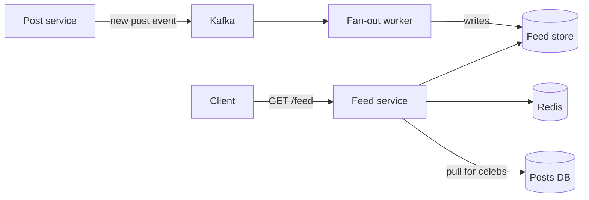

# News feed — design doc

> Practice 05 · After Phase 3

## 1. Requirements

**Functional**
- User opens app → sees a feed of posts from people/topics they follow.
- Post creation, like, comment.
- Ranking (recency + engagement).

**Non-functional**
- Feed fetch p99 < 200ms.
- Fresh posts visible within seconds for normal users; minutes for celebrities.
- DAU: ______; avg follows per user: ______.

## 2. Capacity estimate
- Posts/sec: ______
- Feed reads/sec: ______
- Avg followers per user (median vs p99 — power law!): ______
- Fan-out write amplification = avg_followers × posts/sec: ______

## 3. API
| Method | Path | Description |
|---|---|---|
| POST | `/posts` | create a post |
| GET | `/feed?cursor=...` | paginated feed |
| POST | `/follow/{userId}` | follow |
| POST | `/posts/{id}/like` | like |

## 4. Data model
```
users(id, name, follower_count, following_count)
follows(follower_id, followee_id, created_at)
posts(id ULID, author_id, content, created_at)
feeds(user_id, post_id, score, inserted_at)   -- materialized per user
```

## 5. High-level architecture


## 6. Deep dives

### 6.1 Push (fan-out on write) vs Pull (fan-out on read)
- **Push**: on post, write to every follower's feed list. Fast reads, expensive writes; **breaks for celebrities** (1M followers × every post).
- **Pull**: on read, query latest posts from each followee, merge. Cheap writes, expensive reads.
- **Hybrid (real-world)**: push for normal users, pull for accounts with > N followers; merge at read time.

### 6.2 Ranking
- Compute score = `f(recency, engagement, affinity)`.
- Compute at write time (store score in feed row) or read time (re-rank top K with ML model). Both common.

### 6.3 Pagination
- Cursor-based on `(score, post_id)` — never offset (slow + drifts as feed updates).

### 6.4 Caching
- Hot users' feed pages cached in Redis. Invalidate on new post for that user.

## 7. Failure modes
- Fan-out worker backlog → feed stale. Backpressure + alert on Kafka lag.
- Feed DB hot partitions on celebs (mitigated by pull model).
- Ranking model down → fall back to chronological.

## 8. Trade-offs
- Freshness vs cost: ______
- Push vs pull threshold: ______
- Materialized feeds (storage cost) vs on-the-fly (CPU cost): ______
