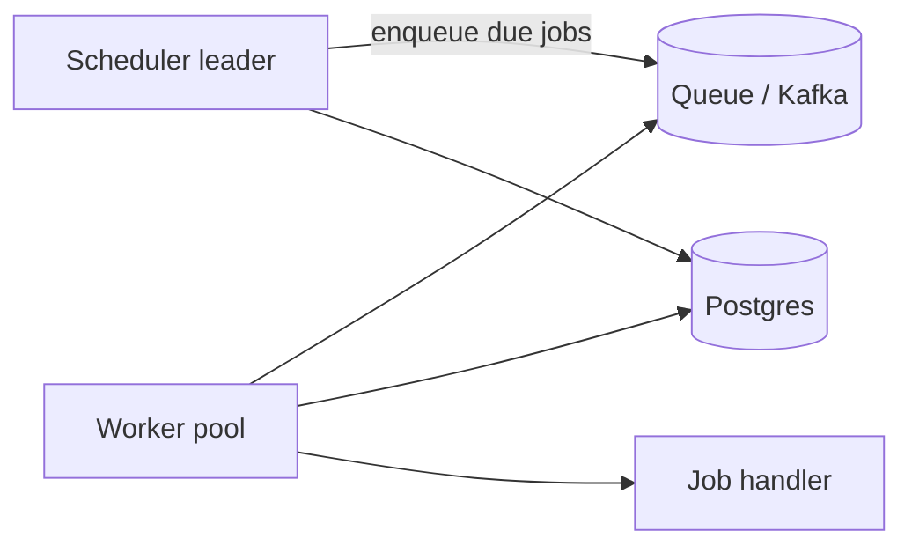

# Distributed job scheduler — design doc

> Practice 06 · After Phase 3

## 1. Requirements

**Functional**
- Schedule one-off or recurring jobs (cron expressions).
- Execute exactly once per scheduled time, even with worker failures.
- Retry on failure with backoff.
- Dashboard: status, history, manual re-run.

**Non-functional**
- Jobs/day: ______
- Latency from scheduled time to start: < 1s p99
- Job runtimes: seconds to hours.
- Survive scheduler instance loss.

## 2. Capacity estimate
- Active recurring jobs: ______
- Avg concurrent running jobs: ______
- DB write rate (status updates): ______

## 3. API
| Method | Path | Body | Description |
|---|---|---|---|
| POST | `/jobs` | `{name, cron, handler, payload}` | create |
| GET | `/jobs/{id}/runs` | — | history |
| POST | `/jobs/{id}/trigger` | — | manual run |

## 4. Data model
```
jobs(id, cron, handler, payload, next_run_at, status, version)
runs(id, job_id, scheduled_at, started_at, finished_at, status, output, attempt)
```
Index on `(status, next_run_at)` for the scheduler scan.

## 5. High-level architecture


## 6. Deep dives

### 6.1 Leader election
- Multiple scheduler instances run; only one scans for due jobs at a time. Use Postgres advisory lock, Redis Redlock, or Zookeeper/etcd. Without it: duplicate runs.

### 6.2 Exactly-once start
- On scan: `SELECT … WHERE next_run_at <= now() FOR UPDATE SKIP LOCKED` → atomically mark as "queued" and bump `next_run_at`.
- Worker dequeues; updates `status=running` with optimistic version check.

### 6.3 Idempotent handlers
- Provide `runId` to the handler; handler must dedupe on it. The system promises at-least-once execution; idempotency is the handler's job.

### 6.4 Retries
- On failure: `attempt++`, requeue with exponential backoff + jitter, until `maxAttempts`. Then mark `failed`, alert.

### 6.5 Long-running jobs & worker death
- Workers heartbeat to extend a lease (`lease_until`). If lease expires, scheduler rescues the job. Handler must be idempotent (see 6.3).

## 7. Failure modes
- Scheduler crash: another instance acquires the leader lock.
- Worker crash mid-job: lease expires → job retried.
- DB outage: scheduler stops dispatching; pending jobs run late once recovered.
- Handler infinite loop: kill-switch via lease expiry + max runtime cap.

## 8. Trade-offs
- Postgres-only (simple) vs Kafka + DB (scalable): ______
- At-least-once (with idempotency) vs exactly-once (complex): ______
- Push handlers vs pull workers: ______
