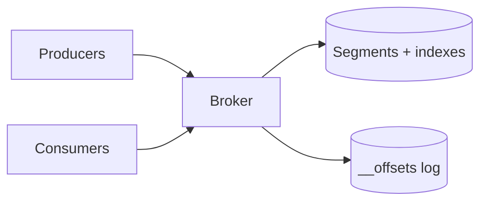

# Mini Kafka — design doc

> Practice 07 · After Phase 4 (the boss level)

The goal: build a single-node, then multi-node, append-only log with partitions and consumer offsets. Not feature-complete Kafka; the **smallest** thing that captures the model.

## 1. Requirements

**Functional**
- Create topics with N partitions.
- Producer: append records to a partition (by key hash or explicit).
- Consumer: read from an offset; commit progress.
- Multiple consumer groups; offsets are per-group, per-partition.

**Non-functional (v1)**
- Single node, no replication.
- Persist records to disk; survive restart.

**Non-functional (v2)**
- Multi-node, leader-per-partition with N-1 followers.
- Producer ack policies: `none`, `leader`, `all`.

## 2. Capacity estimate
- Target throughput: ______ MB/s write
- Record size avg: ______
- Retention: ______ days → disk: ______

## 3. API
- TCP binary protocol (or gRPC for simplicity).
- `Produce(topic, partition, records[])`
- `Fetch(topic, partition, offset, maxBytes)`
- `Commit(group, topic, partition, offset)`
- `FetchOffset(group, topic, partition)`

## 4. Data model — on disk
Per (topic, partition):
- `segments/000000000000.log` — append-only file. Each record: `[len][crc][timestamp][key][value]`.
- `segments/000000000000.index` — sparse `(offset → file position)` for binary search.
- Roll a new segment file every N bytes or time interval.

Per group:
- `__offsets/<group>` — small log of committed offsets, latest wins (or compacted).

## 5. High-level architecture (single node)

## 6. Deep dives

### 6.1 Append path
- Producer sends batch → broker appends to active segment, fsync per policy, returns assigned offset.
- Page-cache friendly: sequential writes are fast.

### 6.2 Fetch path
- Consumer requests `(offset, maxBytes)`. Broker binary-searches the index, opens the .log file from that position, returns bytes.
- **Zero-copy** with `sendfile`/`FileChannel.transferTo` — no copy through user space.

### 6.3 Partitioning
- Producer chooses partition by `hash(key) % numPartitions` (preserves per-key order).
- One log directory per partition → independent throughput.

### 6.4 Consumer groups
- Coordinator assigns partitions to group members (e.g., range or round-robin assignment).
- On member add/remove: rebalance.

### 6.5 Replication (v2)
- Each partition has a leader; followers fetch from leader continuously.
- Leader maintains "in-sync replicas" (ISR). With `acks=all`, leader waits for all ISR before acknowledging.
- Leader election on failure: pick an ISR member.

### 6.6 Retention & compaction
- Time/size-based deletion: drop old segments whole (cheap).
- Log compaction: keep latest value per key (useful for state/snapshots).

## 7. Failure modes
- Power loss between write & fsync → tail of log lost. `acks=all` + fsync per batch is the durable mode.
- Disk full → broker rejects writes; alert + retention enforcement.
- Replica falls behind → drop from ISR; if leader fails, only ISR members eligible to take over.

## 8. Trade-offs
- Fsync per record (durable, slow) vs per batch (fast, small loss window) vs none (fast, brittle): ______
- Range vs round-robin assignment: ______
- Strict ordering vs throughput (key-based partitioning): ______
- Don't try to ship "exactly once" in v1.
